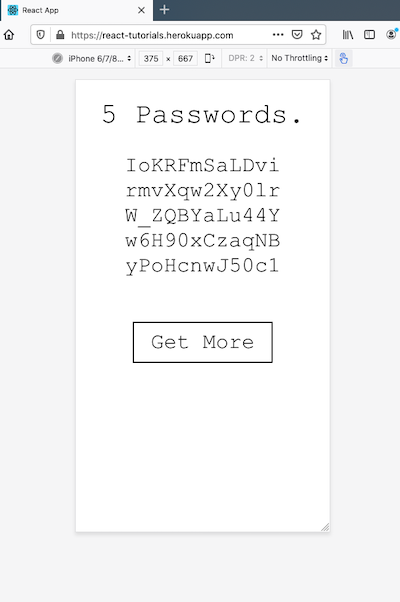

# react-tutorials

This is a container app for hosting various React tutorials I complete.

## Bootstrap a minimal Express / React Heroku-ready dev environment

I want a fairly minimal stack for now.  Maybe just express for the webserver and react for the frontend.  And something Heroku ready would be nice.  The fu in [this blog](https://daveceddia.com/deploy-react-express-app-heroku/) fits the bill.

It's a simple React client that retrieves generated password candidate strings from an express server.  We'll rework the functionality for our puposes.  It just gives us a good starting point for establishing development and deployment work flows with our desired technology stack and hosting platform.



## Directory layout

The basic server directory layout is:

```
./index.js             # server
./package.json         # server config management control file (with Heroku build info)
./node_modules         # third party packages required by server
```

The frontend react code lives in a subdirectory off the server folder and is bootstrapped by a call to 'create-react-app' as described in the blog above.  This configures the webpack toolchain responsible for transforming client code and packages into a deployable, browser-ready bundle.

```
./client               # react client folder
./client/index.js      # generic, top-level build entrypoint for React client
./client/App.js        # application-specific frontend code
./client/package.json  # client config management control file
./client/node_modules  # third party packages required by client
```

### Server configuration management

Running ```npm start``` from the server directory invokes ```node index.js```, starting the web server.
In a deployment scenario, a hook ```heroku-postbuild``` is provided for building the React client bundle.

```
./package.json
{
    "name": "react-tutorials",
    "description": "Container for various react tutorials I complete.",
    "main": "index.js",
    "scripts": {
        "start": "node index.js",
        "heroku-postbuild": "cd client && npm i && npm run build",
        ...
    },
    "dependencies": {
        "express": "^4.17.1",
        ...
    }
}
```

### Client configuration management

Here's a snippet of the client configuration management file.  It contains package dependencies and describes how the client is built and started, etc.  

The proxy port setting is for the development workflow only and describes to the client how to reach the server which is listening for requests on port 5000 in this case.

```
./client/package.json
{
    "name": "client",
    "proxy": "http://localhost:5000",
    "scripts": {
        "start": "react-scripts start",
        "build": "react-scripts build",
        "test": "react-scripts test",
        "eject": "react-scripts eject"
    },
    "dependencies": {
        "react": "^16.13.1",
        "react-dom": "^16.13.1",
        "react-scripts": "3.4.1",
        "@material-ui/core": "^4.9.14",
        ...
    },

```

In development, we have to start the server and then manually start the client:

```
$ npm start &
$ cd client && npm start
```

That's a bit clunky for development, but it works.