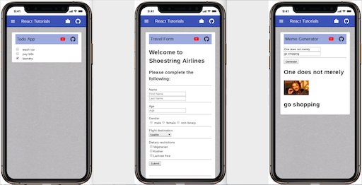
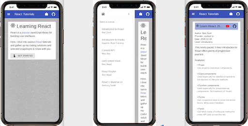

# react-tutorials [(demo)](https://react-tutorials.herokuapp.com/)

### A scalable web app for curating and annotating online tutorials into an emergent curriculum.

---
#### Contents

* [Introduction](#introduction)
* [Deveveloper's Blog](#developers-blog)
  * [Dev platform upgrade](#)
  * [The road ahead](#the-road-ahead)
  * [Responsive landing page](#responsive-landing-page)
  * [Landing page upgrade](#landing-page-upgrade)
  * [Tutorial summary](#tutorial-summary)
  * [Data model](#data-model)
  * [UI design](#user-interface-design)
    * [Requirements](#requirements)
    * [MVP UI](#minimal-viable-ui)
  * [Origin story](#origin-story)
    * [Motivation](#motivation)
    * [Bootstrap to Heroku](#bootstrap-to-heroku)
    * [Project structure](#project-structure)
    * [Server configuration](#server-configuration)
    * [Client configuration](#client-configuration)
* [Tutorial list](#tutorial-list)
* [Photo gallery](#photo-gallery)

---
### [Introduction](#contents)

Let's disrupt the youtube video tutorial scene a bit. :-)

I'm grooving on React these days and want a cool place to collect my learning experience from various tutorials I complete.  There's a ton of good instructional content online, but I want something that allows me to snapshot the journey at key points in the instruction.  I come up with this:


It accommodates different learning styles as described on the landing page:


It features a slide-out drawer that allows you to select a given tutorial to explore.


Users may view one or more solved problems from a tutorial and watch the related video for that problem or drill down into the code itself on github:


The demos are live and reflect specific curriculum goals:



Snapshots of code and video are captured for each key segment of a tutorial:


with ability to quickly see where you're headed:


---

# [Developer's Blog](#contents)

## [Dev platform upgrade](#contents)


Where did that week go?!

My devops genes express themselves strongly.  I've completed enough tutorials and created enough code to realize my dev process itself needs some love and some of my technology choices could be improved.

I notice:

* TypeScript is a thing
* Package managers are evolving
* My code could be prettier

I rebaseline my create-react-app (cra) dev environment for typescript courtesy the ```--template typescript``` option. 

I plug the airbnb coding style guide into a linter with cli and gui integration
for ci and (vscode) workflows.  The automated code formatter, prettier, gets
the same treatment.  

I spin up on the latest thinking around js package management as I wrestle with unmet peer dependencies, crustly cra-bundled packages, and open source dev teams that heroically accommodate the myriad use cases into which their build stacks and utilities gets harnessed.
It looks like yarn and npm each have about 50% of the market, though pnpm also seems
viable and efficient.  Yarn v2 just came out and it looks like a major rewrite.  NPM continues
to evolve under feature pressure from FB's yarn v1 (and now the community-driven v2).  I opt for yarn v1 to expand my horizons and save the v2 experience for another day.  I can definitely use yarn workspaces to organize frontend and backend code nicely.

I even get json schemas for prettier and eslint configurations plugged into vscode's intellisense engine for edit-time hinting as my cursor hovers over key/value pairs.

What the community needs is a configurator for spitting out .eslintrc.json, .prettier.json,
and package.json files given certain input assumptions like:

* dev platform
* package manager preference
* maybe cra version
* typescript or just js
* airbnb style integration?
* runtime environment (node, browser, etc)

I just think of all the collective wasted time people have spent getting these tools hooked up ... the endless number of blogs and videos lovingly crafted around this ritual.

Currently the options are to hangout as a script kitty and bootstrap off of some youtuber's recipe or wade into the depths to be tossed back periodically against the craggly shores, bloodied but undeterred.  I do the latter, of course, trying to discern best practices and collectively accepted limitations.  Generally I start with the cli and get that nice before hooking that into the editor's configuration.  This puts me in good shape for continuous integration at some point (soon).

I'm not sure my eslint configuration is 100%, but it's good enough to illustrate some sketchy stuff I've been doing.  I reorganize the code base so tutorial code may opt-out of linting entirely since tutorial authors seldom drag lint into the picture as they sketch out some lean javscript to illustrate a concept.  I don't want my code snapshots to diverge too much from the video versions on youtube.  But for my
container app, I'll definitely start refactoring that with lint.  I'd like to migrate to TS as well. 

## [The road ahead](#contents)

... better UX on mobile.  Better data model.

After completing a tutorial on Material UI's Drawer component, I realize I'm seriously abusing my users with a persistent drawer on mobile.  I probably should be using a temporary drawer or swipeable variant that disappears easily after item selection.  Plus, a left-anchored slideout on a portrait-oriented phone is just /bad/ because so much content space is occluded when the drawer is open. You can't really enjoy the experience of rapid item selection / surfing and simultaneous content viewing.  A bottom-anchored drawer that covers only 50% of the screen when open versus side-anchored drawer that takes up 80% might be a better option now that I know more about breakpoint styling.  Even in landscape mode, a right-slideout, for example, might be a better option for left-to-right languages since the content window will still have more intelligible snippets that keep the user cognitively anchored to the partially occluded screen space.

I've got some ideas on how to fix all this, but it's gonna require me to refactor my data model for better traversal, searching, and sorting.  The model could also use some normalization.  I'd need to do this work for fullstack anyway and this gets me closer to that while improving UX (once you see what I have in mind :-).

Also, I need to get better about list item keys.  I'm seeing alot of angry red in my console log around ```missing keys```. I'm probably hurting performance to boot.

Initially, I just used the item text as both a key and the ```primaryText``` of the list element's prop.  But I open myself to key collision since two different tutorials may cover the same topic and I won't have the latitude to use the same descriptor for both.

Also the semantics of the model should not get conflated with presentation issues.  In a non-Material UI world, ```<ListItemText primary={primaryText} />``` might not be a thing.  So if I want to target some other frontend library, I should stick to more generic naming in my data model.

Oh, did I mention I want to get React Router in this thing?  That way, people can easily bookmark their favorite tutorials and users will get better feedback on where they are in the tutorial hierarchy as they navigate around.

Also, I want this thing to start driving __more__ __traffic__ _back_ to the social media sites of the tutorial authors to show them some reciprocal love and improve their ad numbers.  That's already a possibility, to an extent, with all the youtube links I embed, but this could be scaled up bit.

This little project has become exactly what I've hoped for ... a vehicle for incrementally _applying_ the knowledge I gain from the tutorials I curate while creating something of value for the community. ♥️

## [Responsive landing page](#contents)

The landing page is clearly optimized for desktop.  On smaller screens, the initial content is very text-centric.  

I want there to be some clear indicator that if you continue to scroll down, you'll find more of the narrative.  I'd like there to be more visual interest as well to entice people to explore and dwell.

So I come up with this, using some of the breakpoint fu I learned from Anothny Sistilli's Material-UI series.


Margins have been trimmed down for mobile (creating space for tutorial card images) and the button width is now full screen for smaller devices.

Here's the styling and code that makes this possible:

Basically the grid of tutorial cards is replicated twice, once above the fold for phones and again below the '1. Select' text on larger display geometries.  The duplicated grids are wrappered in divs with mutually exclusive ```dislay: none``` settings that leverage Material UI's ```theme.breakpoints.up("sm")``` function for returning media queries that apply to browser windows larger that 600px wide.

```
  showOnBigScreens: {
      display: "none",
      [theme.breakpoints.up("sm")]: {
          display: "inherit"
      }
  },
  showOnSmallScreens: {
      display: "inherit",
      [theme.breakpoints.up("sm")]: {
          display: "none"
      }
  }
```

```
  <div className={styles.showOnSmallScreens}>
      <Grid container direction="row" wrap="nowrap" spacing={2} >
          {LandingData.tutorialCardImages.map((imgSrc) => {
              return (
              <Grid item xs={12} sm={12} md={4} xl={4}>
                  <LandingImage imageUrl={imgSrc} />
              </Grid>
              )
          })}
      </Grid>
      <Divider className={styles.divider} />
  </div>
  
  <Typography className={styles.bigText} variant={bigText} gutterBottom > 
      {LandingData.tutorialCardHeader}
  </Typography>

  <Typography paragraph className={styles.bodyText} variant={bodyText}>
      {LandingData.tutorialCardText}
  </Typography>

  <div className={styles.showOnBigScreens}>
      <Grid container direction="row" wrap="nowrap" spacing={2} >
          {LandingData.tutorialCardImages.map((imgSrc) => {
              return (
              <Grid item xs={12} sm={12} md={4} xl={4}>
                  <LandingImage imageUrl={imgSrc} />
              </Grid>
              )
          })}
      </Grid>
  </div>
```

## [Landing page upgrade](#contents)

I'm liking the concept of my little annotated tutorial app.  It has potential to be broadly interesting and potentially disruptive.  But the design notes for the landing page are just off by a decade or so and we are visual creatures afterall.  So I need to fix this first impression.  I don't really have a strong call to action and the whole textured background thing feels like bad wabi sabi.  (Don't hate me, wabi sabi, I'll find my way back to you.)

:-/



So I go casting about for inspiration and find the material design page itself:


Pretty clean and spare.  I like the generous use of white space.  There's a strong narrative as well, something I'm missing, though I know this pup has potential.  Taking these two observations in mind, I come up with this:


I verb-ify the key aspects of the app (learn, select, navigate, arrive) and use those as organizing headers in the copy.  The language is somewhat nautical, suggesting a voyage, something I can riff on more.

I code this up in a fever dream with ugly inline styles and such (which I'll clean up in post) but the overall effect is better, I think.  So shipping it. :-)

Oh, I make liberal use of ```<Grid>``` which I glean from the Material UI tutorials, though I do point-click-and-curse until I find this image fu which maintains aspect ratio within a responsive grid:

```
<Grid item>
  <div style={{minWidth: 0}}>
    
  </div>
</Grid>
```

I still have hair, thanks to this code.

## [Tutorial Summary](#contents)

It'd be nice to get a little summary information on a given tutorial, like when it was written, what level of expertise is expected, who wrote it, plus any special features it offers.

So I do that ...


In my [data model](https://github.com/zenglenn42/react-tutorials/blob/c2e15e0d903b19c9a562729871227b6cc1417a69/client/src/components/api/TutorialData.js#L13), I simply add a summary object for each tutorial in my array of tutorials:

```
const TutorialData = [
{
      summary: {
        provider: "vschool.io",
        courseTitle: "Learn React JS - Full Course for Beginners",
        demoKey: "summary",
        refLink: {
          tipText: "youtube",
          href: "https://youtu.be/DLX62G4lc44",
          icon: <FaYoutube style={{color: "red"}}/>
        },
        codeLink: {
          tipText: "github",
          href: "https://github.com/zenglenn42/react-tutorials/tree/master/client/src/components/vschool"           
        },
        level: "introductory",
        descText: "This nicely paced, 5-hour introduction to React offers plenty of progressive practice.",
        date: "2018-12-18",
        author: "Bob Ziroll",
        features: [
          {
            bulletPoint: "Props",
            bulletText: "Use props to customize components."
          },
          {
            bulletPoint: "Class components",
            bulletText: "Used especially for stateful components.  Introduction to lifecycle methods."
          },
          ...
        ],
      },
      primaryText: "vschool.io",
      solutions: [
        {
          demoKey: "todo",
          primaryText: "Todo App",
          secondaryText: "11. Forms & MVC",
          ...
          demoComponent: <TodoList />
        },
        ...
      ]
    },
]

export default TutorialData
```

Then I create a presentational component, [TutorialSummary](https://github.com/zenglenn42/react-tutorials/blob/c2e15e0d903b19c9a562729871227b6cc1417a69/client/src/components/TutorialSummary.js#L26), for rendering that data nicely:

```
function TutorialSummary(props) {
  const classes = useStyles();

  const summary = (
      <React.Fragment>
          <Toolbar className={classes.Demobar} variant="dense" >
              <Typography variant="h6" noWrap={true}>
              <ReactIcon/> {props.courseTitle}
              ...
          </Toolbar>

          <Typography variant="h7" gutterBottom> 
              Author: {props.author}<br/>
              Provider: {props.provider}<br/>
              Date: {props.date}<br/>
              Level: {props.level}<br/><hr/>
          </Typography>
          ...
      </React.Fragment>
  )
  ...
}
```

I update the [slideout drawer click-handler](https://github.com/zenglenn42/react-tutorials/blob/c2e15e0d903b19c9a562729871227b6cc1417a69/client/src/components/TutorialList.js#L36) to detect when a top-level tutorial list item is clicked,
passing the js object of summary info to the hosting app through the setMainContent callback:

```
export default function TutorialList(props) {

  const handleExpandClick = (e) => {
    const key = e.currentTarget.getAttribute('data-tutorialkey') || "splash"
    const tutorial = tutorialData.filter((tutorial) => {return (tutorial.primaryText === key)})[0]
    props.setMainContent(tutorial.summary)
    ...
  };

  ...
}
```

and then render the [TutorialSummary](https://github.com/zenglenn42/react-tutorials/blob/c2e15e0d903b19c9a562729871227b6cc1417a69/client/src/App.js#L133) component in the main content window, driven by the summary props populated into state by the setMainContent callback:

```
function getMainContent(mainContent, classes, handleDrawerOpen) {
  let content = null
  
  switch (mainContent.demoKey) {
    case "splash":
      content = (
        <React.Fragment>
          <Typography variant="h4" gutterBottom> 
          <ReactIcon/> Learning React
          ...
        </React.Fragment>
      )
      break;

    case "summary":
      content = (
        <TutorialSummary {...mainContent} />
      )
      break;

    ...
  }
}
  
export default function PersistentDrawerLeft(props) {
  const [mainContent, setMainContent] = React.useState({demoKey: props.main})

  ...

  return (
    ...
      <main>
        <div className={classes.drawerHeader} />
        {getMainContent(mainContent, classes, handleDrawerOpen)}
      </main>
  )
}
```

## [Data Model](#contents)

I spend time today adding some intrinsic beauty to the container code.  In the rush to get something working, I inlined the expandable list items in the slideout drawer:

```
      <ListItem button onClick={handleClick}>
        <ListItemText primary="vschool.io" />
        {open["vschool.io"] ? <ExpandLess /> : <ExpandMore />}
      </ListItem >
      <Collapse in={open["vschool.io"]} timeout="auto" unmountOnExit>
        <List component="div" disablePadding>
          <ListItem button className={classes.nested} onClick={handleChoice}>
            <ListItemText
              primary="Joke List"
              secondary="Props and Styling"
            />
          </ListItem>          
          <ListItem button className={classes.nested} onClick={handleChoice}>
            <ListItemText 
              primary="Todo List" 
              secondary="MVC and Forms"
            />
          </ListItem>
          <ListItem button className={classes.nested} onClick={handleChoice}>
            <ListItemText 
              primary="Meme Generator" 
              secondary="Capstone Project"
            />
          </ListItem>
        </List>
```

I pick out all the unique data and organize that as an array in an [api file](https://github.com/zenglenn42/react-tutorials/blob/94a96a82343bc49a0fc3d56846b37c9cf5adb14a/client/src/components/api/TutorialData.js#L1).  This could all be turned into an endpoint, but for now, I have a browser-side static model:

```
import React from 'react';
import MemeGenerator from '../vschool/memeGenerator/MemeGenerator'
import JokeList from '../vschool/jokeList/JokeList'
import TodoList from '../vschool/todo/TodoList'

const TutorialData = [
{
      primaryText: "vschool.io",
      solutions: [
        {
          demoKey: "jokeList",
          primaryText: "Joke List",
          secondaryText: "Props and Styling",
          refLink: {
            tipText: "youtube",
            href: "https://youtu.be/DLX62G4lc44?t=5384"
          },
          codeLink: {
            tipText: "github",
            href: "https://github.com/zenglenn42/react-tutorials/tree/master/client/src/components/vschool/jokeList"           
          },
          demoComponent: <JokeList />
        },
        {
          demoKey: "todo",
          primaryText: "Todo List",
          secondaryText: "MVC and Forms",
          refLink: {
            tipText: "youtube",
            href: "https://youtu.be/DLX62G4lc44?t=2896"
          },
          codeLink: {
            tipText: "github",
            href: "https://github.com/zenglenn42/react-tutorials/tree/master/client/src/components/vschool/todo"           
          },
          demoComponent: <TodoList />
        },
        {
          demoKey: "memeGenerator",
          primaryText: "Meme Generator",
          secondaryText: "Capstone Project",
          refLink: {
            tipText: "youtube",
            href: "https://youtu.be/DLX62G4lc44?t=16569"
          },
          codeLink: {
            tipText: "github",
            href: "https://github.com/zenglenn42/react-tutorials/tree/master/client/src/components/vschool/memeGenerator"           
          },
          demoComponent: <MemeGenerator />
        },
        {
          demoKey: "splash"
        }
      ]
    },
]

export default TutorialData
```

and then just [map](https://github.com/zenglenn42/react-tutorials/blob/c24a626c20fe10267862a5dc4e10c9c5656f259a/client/src/components/TutorialList.js#L60) across that to create the refactored list:

```
{ tutorialData.map((tutorial) => {
    const primaryText = tutorial.primaryText
    const listItem = (
        <ListItem button onClick={handleExpandClick}>
        <ListItemText primary={primaryText} />
        {open[primaryText] ? <ExpandLess /> : <ExpandMore />}
        </ListItem >
    )

    const collapseListItems = tutorial.solutions.map((solution) => {
        return (
        <ListItem button data-tutorialkey={primaryText} data-demokey={solution.demoKey} className={classes.nested} onClick={handleSolutionClick}>
        <ListItemText
            primary={solution.primaryText}
            secondary={solution.secondaryText}
        />
        </ListItem>
        )
    })
    const collapseList = (
        <Collapse in={open[primaryText]} timeout="auto" unmountOnExit>
        <List component="div" disablePadding>
            {collapseListItems}
        </List>
        </Collapse>
    )
    return <React.Fragment>{listItem} {collapseList}</React.Fragment>
})}
```

## [User interface design](#contents)

### [Requirements](#contents)

* As I acquire more React knowledge, I'll want to aggregate solutions from multiple books and online tutorials.  So I need a design that scales for that.  
* I also want it to be responsive.
* Links to my own github blog and code sections would be good along with the runnable demo code.  
* I'm not really down for custom-designing some exotic interface.  I just want to sensibly combine UI components which are already out there.
* Making the container searchable would be very useful.

I think about various design elements:

* Carousels
* Breadcrumbs
* Slideout drawers

While traversing the [material-ui site](https://material-ui.com/) for their components, I notice they use slideout drawers to good effect.  


Instead of components, I could drop in Tutorial providers with my selected solutions as sub-categories.  Comme ça:


This container could even scale up to host my _entire_ portfolio.

#### [Minimal Viable UI](#contents)

This is what my user interface is looking like with video and code links added to each demo.


## [Origin story](#contents)

### [Motivation](#contents)

A few weeks ago, I completed Bob Ziroll's really nice React tutorial on [youtube](https://youtu.be/DLX62G4lc44).

It'd be nice to share my solutions in an associative context should I ever need to refer back to something I'd learned.  True, I could just blast stuff to [codesandbox](https://codesandbox.io/).  But I want to linger and play with React itself and crafting a React-based container for my solutions is a good design exercise, something I could plug into my growing portfolio.

### [Bootstrap to Heroku](#contents)

I want a minimal stack for now.  Just express for the web server and definitely react for the front end (since that's the whole point)
and something Heroku-ready would be a low impedance.  I'm not really using the backend at the moment, but that may change as the tutorials get more sophisticated.

The fu in [this blog](https://daveceddia.com/deploy-react-express-app-heroku/) from Dave Ceddia fits the bill!

It's a simple React client that retrieves generated password candidate strings from an express server.

Eventually, I'll replace the generator logic with stuff I need for my tutorial solutions.  It just gives me a good starting point for establishing development and deployment workflows with our desired technology stack and hosting platform.


### [Project structure](#contents)

The basic server directory layout is:

```
./index.js             # server
./package.json         # server config management control file (with Heroku build info)
./node_modules         # third party packages required by server
```

The frontend react code lives in a subdirectory off the server folder and is bootstrapped by a call to 'create-react-app' as described in the blog above.  This configures the webpack toolchain responsible for transforming client code and packages into a deployable, browser-ready bundle.

```
./client               # react client folder
./client/index.js      # generic, top-level build entrypoint for React client
./client/App.js        # application-specific frontend code
./client/package.json  # client config management control file
./client/node_modules  # third party packages required by client
```

### [Server configuration](#contents)

Running ```npm start``` from the server directory invokes ```node index.js```, starting the web server.
In a deployment scenario, a hook ```heroku-postbuild``` is provided for building the React client bundle.

```
./package.json
{
    "name": "react-tutorials",
    "description": "Container for various react tutorials I complete.",
    "main": "index.js",
    "scripts": {
        "start": "node index.js",
        "heroku-postbuild": "cd client && npm i && npm run build",
        ...
    },
    "dependencies": {
        "express": "^4.17.1",
        ...
    }
}
```

### [Client configuration](#contents)

Here's a snippet of the client configuration management file.  It contains package dependencies and describes how the client is built and started, etc.  

The proxy port setting is for the development workflow only and describes to the client how to reach the server which is listening for requests on port 5000 in this case.

```
./client/package.json
{
    "name": "client",
    "proxy": "http://localhost:5000",
    "scripts": {
        "start": "react-scripts start",
        "build": "react-scripts build",
        "test": "react-scripts test",
        "eject": "react-scripts eject"
    },
    "dependencies": {
        "react": "^16.13.1",
        "react-dom": "^16.13.1",
        "react-scripts": "3.4.1",
        "@material-ui/core": "^4.9.14",
        ...
    },

```

In development, we start the web server and client as two separate steps:

```
$ npm start &
$ cd client && npm start
```

We can then browse to localhost:3000.  I may streamline this.

In production on Heroku, our server is already running and the client bundle is prebuilt and deployable simply by visiting:

```
https://react-tutorials.herokuap.com
```

### [Tutorial list](#contents)

Hosted solutions are available for the following tutorials:

#### Bob Ziroll

[](http://www.youtube.com/watch?v=DLX62G4lc44 "React in 5 hours 2019")

#### Brad Traversy and Kapeche

[](http://www.youtube.com/watch?v=mxK8b99iJTg "Introducing React Hooks")

#### Wes Bos

[](http://www.youtube.com/watch?v=XLJN4JfniH4 "React's New Context API")

#### Ben Awad

[](http://www.youtube.com/watch?v=9xhKH43llhU "React Hooks useState Tutorial")

[](http://www.youtube.com/watch?v=j1ZRyw7OtZs "React Hooks useEffect Tutorial")

[](http://www.youtube.com/watch?v=W6AJ-gRupCs "React Hooks useRef Tutorial")

[](http://www.youtube.com/watch?v=ommC6fS1SZg "React Hooks useLayoutEffect Tutorial")

[](http://www.youtube.com/watch?v=lhMKvyLRWo0 "React Hooks useContext Tutorial (Storing a User")

[](http://www.youtube.com/watch?v=110dW3l5GQY "React Router")

[](http://www.youtube.com/watch?v=pNjeuU4Jwnc "Basic Tables in React using Material UI")

#### Anthony Sistilli

[](http://www.youtube.com/watch?v=pHclLuRolzE "React + Material UI #1: Introduction - 2020 Edition")

[](http://www.youtube.com/watch?v=tKzSnjWPtEw "React + Material UI #2: React + Material UI #2: Actually coding a UX design")

[](http://www.youtube.com/watch?v=k_AN49fA9g0 "React + Material UI #3: makeStyles")

[](http://www.youtube.com/watch?v=ewq0UgnQo9E "React + Material UI #4: Button")

[](http://www.youtube.com/watch?v=OvPrUQ3gPtw "React + Material UI #5: Typography")

[](http://www.youtube.com/watch?v=Q4o0GmfNpJc "React + Material UI #6: Themes")

[](http://www.youtube.com/watch?v=nmCcr-Y9qdc "React + Material UI #7: Paper")

[](http://www.youtube.com/watch?v=H_PO_GY4xXU "React + Material UI #8: Dark Mode")

[](http://www.youtube.com/watch?v=GsSnfTKn8To "React + Material UI #9: Templates")

[](http://www.youtube.com/watch?v=WV6u_6ZNWkQ "React + Material UI #10: Grid")

[](http://www.youtube.com/watch?v=Z9xgsSVJGWk "React + Material UI #11: Grid Centering")

[](http://www.youtube.com/watch?v=UNCq01LNNrg "React + Material UI #12: Cards + Card layout with Grid")

[](http://www.youtube.com/watch?v=-3Ybk8VfFt4 "React + Material UI #13: Tables")

[](http://www.youtube.com/watch?v=CjFWbEOcq-Y "React + Material UI #21: Drawer & Drawer + React Router")

[](http://www.youtube.com/watch?v=LZKsD_5ttZ4 "React Classes to Hooks: Everything about useState & useEffect")

# [Photo Gallery](#contents)

## Anthony Sistilli's tutorial on Material UI Design-to-Implementation


Anthony Sistilli has done a beautiful job with his React + Material UI tutorial series.  I recently worked through his figma design-to-implementation tutorial and captured some snapshots along the way.


##### Progression from skeleton app to responsive product page.

The final implementation makes good use of Material UI Grid and various Card components along with an AppBar.  The best thing about this tutorial is just the basic work flow one takes to break down a design into components and thinking about how those components would live within a responsive grid.


