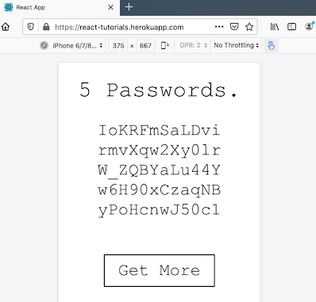

# react-tutorials

This is a container app for hosting various React tutorials I complete.

## User interface design for a container of tutorial solutions

A few weeks ago, I completed Bob Ziroll's really nice React tutorial on [youtube](https://youtu.be/DLX62G4lc44).

I thought it would be nice to oranize my solutions and make them shareable.  I could just blast them to [codesandbox](https://codesandbox.io/).  But I want to play around with React itself and crafting a React-based container for my solutions would be a good design exercise and something I could plug into my growing portfolio.

As I acquire more React knowledge, I'll want to aggregate solutions from multiple books and online tutorials.  So I need a design that scales for that.  I also want it to be responsive.  Some animation might be nice.  Links to my own github blog and code sections would be good along with the runnable demo code.  I'm not really down for custom-designing some new, exotic interface, though.  I just want to sensibly combine UI components which are already out there. I think about various design elements:

* Carousels
* Breadcrumbs
* Slideout drawers

While traversing the [material-ui site](https://material-ui.com/) for their components, I notice they use slideout drawers to good effect.  


Instead of components, I could drop in Tutorial providers with my selected solutions as sub-categories.  Comme ça:


This container could even scale up to /host/ my entire portfolio.

## Bootstrap a minimal Heroku-ready express/react stack 

I want a fairly minimal stack for now.  Maybe just express for the web server and definitely react for the front end (since that's the whole point of these tutorials) and something Heroku-ready would be nice.

The fu in [this blog](https://daveceddia.com/deploy-react-express-app-heroku/) from Dave Ceddia fits the bill!

It's a simple React client that retrieves generated password candidate strings from an express server.

Eventually, I'll replace the generator logic with stuff I need for my tutorial solutions.  It just gives me a good starting point for establishing development and deployment workflows with our desired technology stack and hosting platform.



## Directory layout

The basic server directory layout is:

```
./index.js             # server
./package.json         # server config management control file (with Heroku build info)
./node_modules         # third party packages required by server
```

The frontend react code lives in a subdirectory off the server folder and is bootstrapped by a call to 'create-react-app' as described in the blog above.  This configures the webpack toolchain responsible for transforming client code and packages into a deployable, browser-ready bundle.

```
./client               # react client folder
./client/index.js      # generic, top-level build entrypoint for React client
./client/App.js        # application-specific frontend code
./client/package.json  # client config management control file
./client/node_modules  # third party packages required by client
```

### Server configuration management

Running ```npm start``` from the server directory invokes ```node index.js```, starting the web server.
In a deployment scenario, a hook ```heroku-postbuild``` is provided for building the React client bundle.

```
./package.json
{
    "name": "react-tutorials",
    "description": "Container for various react tutorials I complete.",
    "main": "index.js",
    "scripts": {
        "start": "node index.js",
        "heroku-postbuild": "cd client && npm i && npm run build",
        ...
    },
    "dependencies": {
        "express": "^4.17.1",
        ...
    }
}
```

### Client configuration management

Here's a snippet of the client configuration management file.  It contains package dependencies and describes how the client is built and started, etc.  

The proxy port setting is for the development workflow only and describes to the client how to reach the server which is listening for requests on port 5000 in this case.

```
./client/package.json
{
    "name": "client",
    "proxy": "http://localhost:5000",
    "scripts": {
        "start": "react-scripts start",
        "build": "react-scripts build",
        "test": "react-scripts test",
        "eject": "react-scripts eject"
    },
    "dependencies": {
        "react": "^16.13.1",
        "react-dom": "^16.13.1",
        "react-scripts": "3.4.1",
        "@material-ui/core": "^4.9.14",
        ...
    },

```

In development, we start the web server and client as two separate steps:

```
$ npm start &
$ cd client && npm start
```

We can then browse to localhost:3000.  I may streamline this.

In production on Heroku, our server is already running and the client bundle is prebuilt and deployable simply by visiting:

```
https://react-tutorials.herokuap.com
```