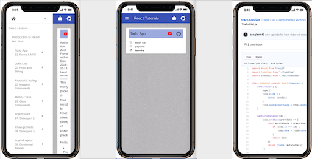
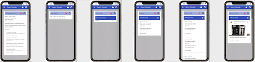

# react-tutorials [(demo)](https://react-tutorials.herokuapp.com/)

Let's disrupt the youtube video tutorial scene a bit. :-)

I'm grooving on React these days and want a cool place to collect my learning experience from various tutorials I complete.  There's a ton of good instructional content online, but I want something that allows me to snapshot the journey at key points in the instruction.  I come up with this:


It accommodates different learning styles as described on the landing page:


It features a slide-out drawer that allows you to select a given tutorial to explore.


Users may view one or more solved problems from a tutorial and watch the related video for that problem or drill down into the code itself on github:



The demos are live and reflect specific curriculum goals:


Snapshots of code and video are captured for each key segment of a tutorial:



with ability to quickly see where you're headed:


Hosted solutions are available for the following tutorials:

#### Bob Ziroll

[](http://www.youtube.com/watch?v=DLX62G4lc44 "React in 5 hours 2019")

#### Brad Traversy and Kapeche

[](http://www.youtube.com/watch?v=mxK8b99iJTg "Introducing React Hooks")

#### Wes Bos

[](http://www.youtube.com/watch?v=XLJN4JfniH4 "React's New Context API")

#### Ben Awad

[](http://www.youtube.com/watch?v=lhMKvyLRWo0 "React Hooks useContext Tutorial (Storing a User")

[](http://www.youtube.com/watch?v=110dW3l5GQY "React Router")

#### Anthony Sistilli

[](http://www.youtube.com/watch?v=pHclLuRolzE "React + Material UI #1: Introduction - 2020 Edition")

[](http://www.youtube.com/watch?v=tKzSnjWPtEw "React + Material UI #2: React + Material UI #2: Actually coding a UX design")

[](http://www.youtube.com/watch?v=k_AN49fA9g0 "React + Material UI #3: makeStyles")

[](http://www.youtube.com/watch?v=ewq0UgnQo9E "React + Material UI #4: Button")

[](http://www.youtube.com/watch?v=OvPrUQ3gPtw "React + Material UI #5: Typography")

[](http://www.youtube.com/watch?v=Q4o0GmfNpJc "React + Material UI #6: Themes")

[](http://www.youtube.com/watch?v=nmCcr-Y9qdc "React + Material UI #7: Paper")

[](http://www.youtube.com/watch?v=H_PO_GY4xXU "React + Material UI #8: Dark Mode")

[](http://www.youtube.com/watch?v=GsSnfTKn8To "React + Material UI #9: Templates")

[](http://www.youtube.com/watch?v=WV6u_6ZNWkQ "React + Material UI #10: Grid")

[](http://www.youtube.com/watch?v=Z9xgsSVJGWk "React + Material UI #11: Grid Centering")

[](http://www.youtube.com/watch?v=CjFWbEOcq-Y "React + Material UI #21: Drawer & Drawer + React Router")

# Developer's Blog

A few weeks ago, I completed Bob Ziroll's really nice React tutorial on [youtube](https://youtu.be/DLX62G4lc44).

I thought it would be nice to oranize my solutions and make them shareable.  I could just blast them to [codesandbox](https://codesandbox.io/).  But I want to play around with React itself and crafting a React-based container for my solutions would be a good design exercise and something I could plug into my growing portfolio.

## Bootstrap a minimal Heroku-ready express/react stack 

I want a fairly minimal stack for now.  Maybe just express for the web server and definitely react for the front end (since that's the whole point of these tutorials) and something Heroku-ready would be nice.

The fu in [this blog](https://daveceddia.com/deploy-react-express-app-heroku/) from Dave Ceddia fits the bill!

It's a simple React client that retrieves generated password candidate strings from an express server.

Eventually, I'll replace the generator logic with stuff I need for my tutorial solutions.  It just gives me a good starting point for establishing development and deployment workflows with our desired technology stack and hosting platform.


## Directory layout

The basic server directory layout is:

```
./index.js             # server
./package.json         # server config management control file (with Heroku build info)
./node_modules         # third party packages required by server
```

The frontend react code lives in a subdirectory off the server folder and is bootstrapped by a call to 'create-react-app' as described in the blog above.  This configures the webpack toolchain responsible for transforming client code and packages into a deployable, browser-ready bundle.

```
./client               # react client folder
./client/index.js      # generic, top-level build entrypoint for React client
./client/App.js        # application-specific frontend code
./client/package.json  # client config management control file
./client/node_modules  # third party packages required by client
```

### Server configuration management

Running ```npm start``` from the server directory invokes ```node index.js```, starting the web server.
In a deployment scenario, a hook ```heroku-postbuild``` is provided for building the React client bundle.

```
./package.json
{
    "name": "react-tutorials",
    "description": "Container for various react tutorials I complete.",
    "main": "index.js",
    "scripts": {
        "start": "node index.js",
        "heroku-postbuild": "cd client && npm i && npm run build",
        ...
    },
    "dependencies": {
        "express": "^4.17.1",
        ...
    }
}
```

### Client configuration management

Here's a snippet of the client configuration management file.  It contains package dependencies and describes how the client is built and started, etc.  

The proxy port setting is for the development workflow only and describes to the client how to reach the server which is listening for requests on port 5000 in this case.

```
./client/package.json
{
    "name": "client",
    "proxy": "http://localhost:5000",
    "scripts": {
        "start": "react-scripts start",
        "build": "react-scripts build",
        "test": "react-scripts test",
        "eject": "react-scripts eject"
    },
    "dependencies": {
        "react": "^16.13.1",
        "react-dom": "^16.13.1",
        "react-scripts": "3.4.1",
        "@material-ui/core": "^4.9.14",
        ...
    },

```

In development, we start the web server and client as two separate steps:

```
$ npm start &
$ cd client && npm start
```

We can then browse to localhost:3000.  I may streamline this.

In production on Heroku, our server is already running and the client bundle is prebuilt and deployable simply by visiting:

```
https://react-tutorials.herokuap.com
```

## User interface design for a container of tutorial solutions

### Requirements

* As I acquire more React knowledge, I'll want to aggregate solutions from multiple books and online tutorials.  So I need a design that scales for that.  
* I also want it to be responsive.
* Links to my own github blog and code sections would be good along with the runnable demo code.  
* I'm not really down for custom-designing some exotic interface.  I just want to sensibly combine UI components which are already out there.
* Making the container searchable would be very useful.

I think about various design elements:

* Carousels
* Breadcrumbs
* Slideout drawers

While traversing the [material-ui site](https://material-ui.com/) for their components, I notice they use slideout drawers to good effect.  


Instead of components, I could drop in Tutorial providers with my selected solutions as sub-categories.  Comme ça:


This container could even scale up to host my _entire_ portfolio.

#### Minimal Viable User Interface

This is what my user interface is looking like with video and code links added to each demo.


## Refactor UI to be more data-driven

I spend time today adding some intrinsic beauty to the container code.  In the rush to get something working, I inlined the expandable list items in the slideout drawer:

```
      <ListItem button onClick={handleClick}>
        <ListItemText primary="vschool.io" />
        {open["vschool.io"] ? <ExpandLess /> : <ExpandMore />}
      </ListItem >
      <Collapse in={open["vschool.io"]} timeout="auto" unmountOnExit>
        <List component="div" disablePadding>
          <ListItem button className={classes.nested} onClick={handleChoice}>
            <ListItemText
              primary="Joke List"
              secondary="Props and Styling"
            />
          </ListItem>          
          <ListItem button className={classes.nested} onClick={handleChoice}>
            <ListItemText 
              primary="Todo List" 
              secondary="MVC and Forms"
            />
          </ListItem>
          <ListItem button className={classes.nested} onClick={handleChoice}>
            <ListItemText 
              primary="Meme Generator" 
              secondary="Capstone Project"
            />
          </ListItem>
        </List>
```

I pick out all the unique data and organize that as an array in an [api file](https://github.com/zenglenn42/react-tutorials/blob/94a96a82343bc49a0fc3d56846b37c9cf5adb14a/client/src/components/api/TutorialData.js#L1):

```
import React from 'react';
import MemeGenerator from '../vschool/memeGenerator/MemeGenerator'
import JokeList from '../vschool/jokeList/JokeList'
import TodoList from '../vschool/todo/TodoList'

const TutorialData = [
{
      primaryText: "vschool.io",
      solutions: [
        {
          demoKey: "jokeList",
          primaryText: "Joke List",
          secondaryText: "Props and Styling",
          refLink: {
            tipText: "youtube",
            href: "https://youtu.be/DLX62G4lc44?t=5384"
          },
          codeLink: {
            tipText: "github",
            href: "https://github.com/zenglenn42/react-tutorials/tree/master/client/src/components/vschool/jokeList"           
          },
          demoComponent: <JokeList />
        },
        {
          demoKey: "todo",
          primaryText: "Todo List",
          secondaryText: "MVC and Forms",
          refLink: {
            tipText: "youtube",
            href: "https://youtu.be/DLX62G4lc44?t=2896"
          },
          codeLink: {
            tipText: "github",
            href: "https://github.com/zenglenn42/react-tutorials/tree/master/client/src/components/vschool/todo"           
          },
          demoComponent: <TodoList />
        },
        {
          demoKey: "memeGenerator",
          primaryText: "Meme Generator",
          secondaryText: "Capstone Project",
          refLink: {
            tipText: "youtube",
            href: "https://youtu.be/DLX62G4lc44?t=16569"
          },
          codeLink: {
            tipText: "github",
            href: "https://github.com/zenglenn42/react-tutorials/tree/master/client/src/components/vschool/memeGenerator"           
          },
          demoComponent: <MemeGenerator />
        },
        {
          demoKey: "splash"
        }
      ]
    },
]

export default TutorialData
```

and then just [map](https://github.com/zenglenn42/react-tutorials/blob/c24a626c20fe10267862a5dc4e10c9c5656f259a/client/src/components/TutorialList.js#L60) across that to create the refactored list:

```
{ tutorialData.map((tutorial) => {
    const primaryText = tutorial.primaryText
    const listItem = (
        <ListItem button onClick={handleExpandClick}>
        <ListItemText primary={primaryText} />
        {open[primaryText] ? <ExpandLess /> : <ExpandMore />}
        </ListItem >
    )

    const collapseListItems = tutorial.solutions.map((solution) => {
        return (
        <ListItem button data-tutorialkey={primaryText} data-demokey={solution.demoKey} className={classes.nested} onClick={handleSolutionClick}>
        <ListItemText
            primary={solution.primaryText}
            secondary={solution.secondaryText}
        />
        </ListItem>
        )
    })
    const collapseList = (
        <Collapse in={open[primaryText]} timeout="auto" unmountOnExit>
        <List component="div" disablePadding>
            {collapseListItems}
        </List>
        </Collapse>
    )
    return <React.Fragment>{listItem} {collapseList}</React.Fragment>
})}
```

## Tutorial Summary

It'd be nice to get a little summary information on a given tutorial, like when it was written, what level of expertise is expected, who wrote it, plus any special features it offers.

So I do that ...


In my [data model](https://github.com/zenglenn42/react-tutorials/blob/c2e15e0d903b19c9a562729871227b6cc1417a69/client/src/components/api/TutorialData.js#L13), I simply add a summary object for each tutorial in my array of tutorials:

```
const TutorialData = [
{
      summary: {
        provider: "vschool.io",
        courseTitle: "Learn React JS - Full Course for Beginners",
        demoKey: "summary",
        refLink: {
          tipText: "youtube",
          href: "https://youtu.be/DLX62G4lc44",
          icon: <FaYoutube style={{color: "red"}}/>
        },
        codeLink: {
          tipText: "github",
          href: "https://github.com/zenglenn42/react-tutorials/tree/master/client/src/components/vschool"           
        },
        level: "introductory",
        descText: "This nicely paced, 5-hour introduction to React offers plenty of progressive practice.",
        date: "2018-12-18",
        author: "Bob Ziroll",
        features: [
          {
            bulletPoint: "Props",
            bulletText: "Use props to customize components."
          },
          {
            bulletPoint: "Class components",
            bulletText: "Used especially for stateful components.  Introduction to lifecycle methods."
          },
          ...
        ],
      },
      primaryText: "vschool.io",
      solutions: [
        {
          demoKey: "todo",
          primaryText: "Todo App",
          secondaryText: "11. Forms & MVC",
          ...
          demoComponent: <TodoList />
        },
        ...
      ]
    },
]

export default TutorialData
```

Then I create a presentational component, [TutorialSummary](https://github.com/zenglenn42/react-tutorials/blob/c2e15e0d903b19c9a562729871227b6cc1417a69/client/src/components/TutorialSummary.js#L26), for rendering that data nicely:

```
function TutorialSummary(props) {
  const classes = useStyles();

  const summary = (
      <React.Fragment>
          <Toolbar className={classes.Demobar} variant="dense" >
              <Typography variant="h6" noWrap={true}>
              <ReactIcon/> {props.courseTitle}
              ...
          </Toolbar>

          <Typography variant="h7" gutterBottom> 
              Author: {props.author}<br/>
              Provider: {props.provider}<br/>
              Date: {props.date}<br/>
              Level: {props.level}<br/><hr/>
          </Typography>
          ...
      </React.Fragment>
  )
  ...
}
```

I update the [slideout drawer click-handler](https://github.com/zenglenn42/react-tutorials/blob/c2e15e0d903b19c9a562729871227b6cc1417a69/client/src/components/TutorialList.js#L36) to detect when a top-level tutorial list item is clicked,
passing the js object of summary info to the hosting app through the setMainContent callback:

```
export default function TutorialList(props) {

  const handleExpandClick = (e) => {
    const key = e.currentTarget.getAttribute('data-tutorialkey') || "splash"
    const tutorial = tutorialData.filter((tutorial) => {return (tutorial.primaryText === key)})[0]
    props.setMainContent(tutorial.summary)
    ...
  };

  ...
}
```

and then render the [TutorialSummary](https://github.com/zenglenn42/react-tutorials/blob/c2e15e0d903b19c9a562729871227b6cc1417a69/client/src/App.js#L133) component in the main content window, driven by the summary props populated into state by the setMainContent callback:

```
function getMainContent(mainContent, classes, handleDrawerOpen) {
  let content = null
  
  switch (mainContent.demoKey) {
    case "splash":
      content = (
        <React.Fragment>
          <Typography variant="h4" gutterBottom> 
          <ReactIcon/> Learning React
          ...
        </React.Fragment>
      )
      break;

    case "summary":
      content = (
        <TutorialSummary {...mainContent} />
      )
      break;

    ...
  }
}
  
export default function PersistentDrawerLeft(props) {
  const [mainContent, setMainContent] = React.useState({demoKey: props.main})

  ...

  return (
    ...
      <main>
        <div className={classes.drawerHeader} />
        {getMainContent(mainContent, classes, handleDrawerOpen)}
      </main>
  )
}
```

## I add a tutorial on React Hooks


This provides a guided sequence for implementing a classic todo list using function-based components that leverage the useState() primitive for capturing and mutating state within a function (as opposed to a class).  In this case, the textual description of the item along with its state of completion are managed through state.

We start off by rendering a simple list of todo items and end up with a modest app that can mark items 'done' and delete them as well.  The app is simple and does not persist state across sessions, so if you refresh the page, you'll see the same initial items appear again.  Maybe I'll leverage session or local storage in a follow-on exercise to address persistence.


##### Progression from list to hooks-based Todo App

## I add a tutorial on Material UI Design-to-Implementation


Anthony Sistilli has done a beautiful job with his React + Material UI tutorial series.  I recently worked through his figma design-to-implementation tutorial and captured some snapshots along the way.


##### Progression from skeleton app to responsive product page.

The final implementation makes good use of Material UI Grid and various Card components along with an AppBar.  The best thing about this tutorial is just the basic work flow one takes to break down a design into components and thinking about how those components would live within a responsive grid.


## I upgrade the landing page

I'm liking the concept of my little annotated tutorial app.  It has potential to be broadly interesting and potentially disruptive.  But the design notes for the landing page are just off by a decade or so and we are visual creatures afterall.  So I need to fix this first impression.  I don't really have a strong call to action and the whole textured background thing feels like bad wabi sabi.  (Don't hate me, wabi sabi, I'll find my way back to you.)

:-/


So I go casting about for inspiration and find the material design page itself:


Pretty clean and spare.  I like the generous use of white space.  There's a strong narrative as well, something I'm missing, though I know this pup has potential.  Taking these two observations in mind, I come up with this:


I verb-ify the key aspects of the app (learn, select, navigate, arrive) and use those as organizing headers in the copy.  The language is somewhat nautical, suggesting a voyage, something I can riff on more.

I code this up in a fever dream with ugly inline styles and such (which I'll clean up in post) but the overall effect is better, I think.  So shipping it. :-)

Oh, I made liberal use of ```<Grid>``` which I gleaned from Anthony Sistilli's Material UI tutorials, though did a fair amount of point-click-and-cursing until I found this fu which maintains image aspect ratio of my carefully crafted graphics within a responsive grid:

```
<Grid item>
  <div style={{minWidth: 0}}>
    
  </div>
</Grid>
```

I still have have hair, thanks to this code.
